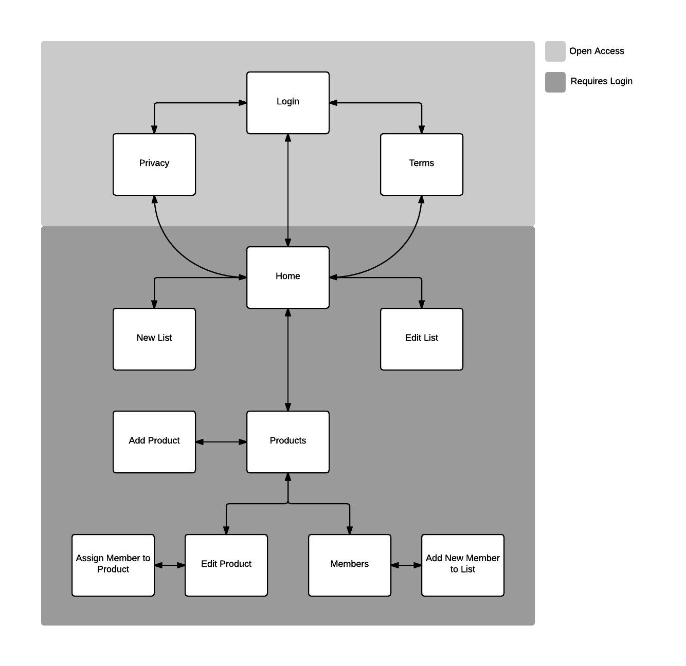
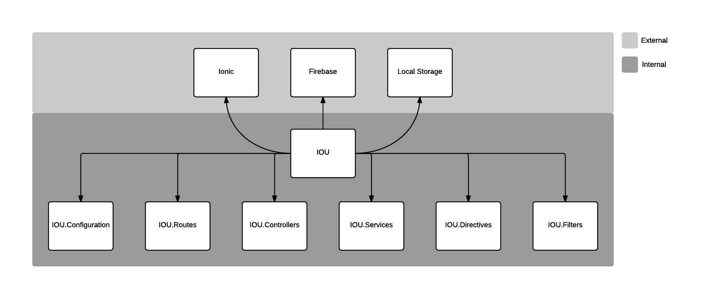
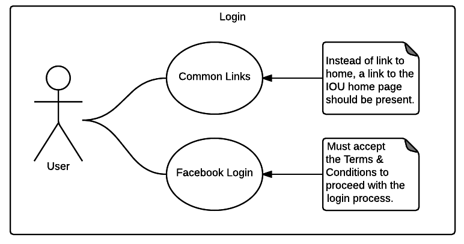
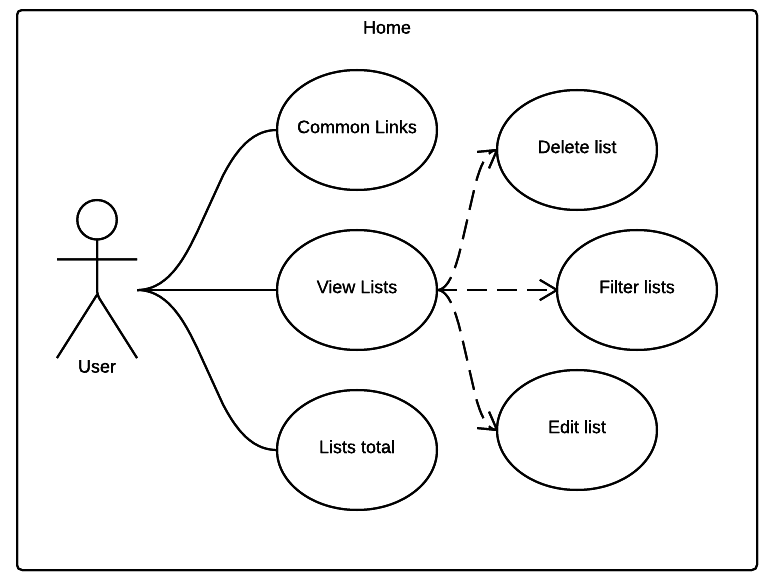
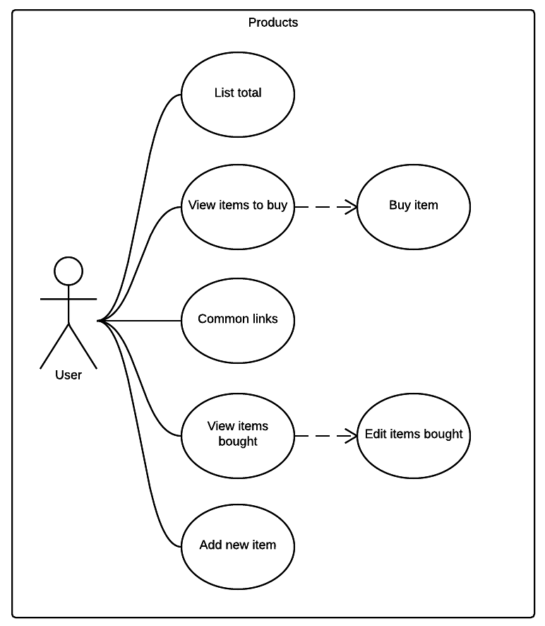
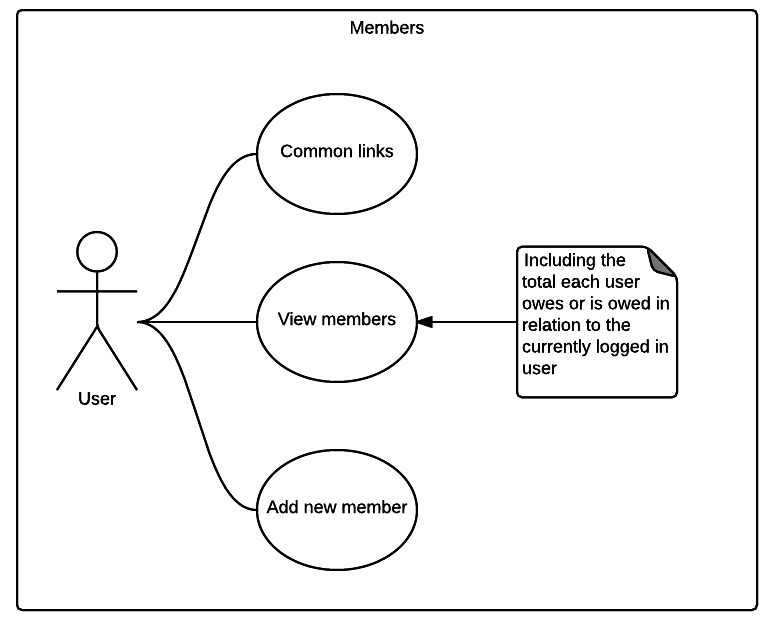

# Chapter 4

## Data Findings

As a result, three applications were developed for this assignment, an Android application, an iOS application and a web application. In summary, all apps do not diverge from the original source code, they have simply been compiled for different platforms.

Unfortunately, by the time of this writting, the iOS application is still under approval by Apple, please keep on checking the live vesion of this documentation at the link below as it will be made available as soon as the app goes live:

[http://iou.rocks](http://iou.rocks)

The Android application can be downloaded and installed from the link below:

[https://play.google.com/store/apps/details?id=com.jbonigomes.IOU](https://play.google.com/store/apps/details?id=com.jbonigomes.IOU)

A web version of the application has also been made available at the following link:

[https://ioutest.firebaseapp.com](https://ioutest.firebaseapp.com)

It is important to note that since the codebase for the web app and the mobile apps are the same, a greater amount of care has been taken towards the mobile apps, and therefore, the webapp lacks a slight level completeness. The main issue lies within the fact that page refreshes may render the application unusable, should that occur, one must click the home button in the top left of the application then refresh the page again. This issue has been added to the backlog and once the web app is deemed to be sufficiently good it will be published in a new URL that does not contain the word 'test' in it.

Chapter 6 develops further towards what is reccommended for future improvements, however, an archiving system that was originally planned could not be implemented yet, this has however been added to the backlog and will be developed in a future version. To cover the lack of an archiving system, for now, users have the option to completely delete a list, IOU reccomends to only delete a list once all members are satisfied that the amount owed to each other meets their expetancy.

## Information Architecture

The information architecture for IOU takes in consideration the overall user experience aiming to logically group sections that relate to each other and layer them down based on importance.

_Fig 1 - Information architecture_

Although not explicitly demonstrated, all states that require login present a link that goes straight back to the home page as well as a quick access slide menu that displays information about the currently logged user, and present links to the home page, privacy page, terms and conditions page and logout.

## Angular Architecture

The application dependencies look like the following diagram:

_Fig 1 - Angular architecture_

Centrally located is the IOU module, where the applications' run method is located, this module declares the external and internal dependencies that together form the final product.

## Use cases

In addition to the information architecture depicted above, this section develops further into the user journey analysing each scenario a user may encounter.

The use case diagrams below assume that 'Common Links' refers to the following links:

- Home page
- Terms and Conditions page
- Privacy Policy page

Also, the diagrams do not explicitly show that for every stage that requiquires a login, a logout link is also provided.

Before having access to the application, the user must first accept the terms and conditions and login.

_Fig 1 - Login Use Case_

The home page shows all lists that the current logged user belongs to. Allows creating, editing, deleting and filtering lists. Each list also displays their total in relation to the logged user. The top of the page should give a summary of the whole total between all lists in relation to the currently logged in user.

_Fig 1 - Home Use Case_

The products view should display a list of all products that are due to be bougth as well as all the products that have been bought. It should allow creating new products, buying products and editing products. It should also display a total for the current list in relation to the logged in user.

_Fig 1 - Products Use Case_

The members view should show all members that belong to the current list. Each member should be displayed with a calculated field of how much they owe or are owed in relation to the currently logged in user. The same list overall total that appears in the products page should be displayed at the top of the members page too. From the members view, new members could also be added.

_Fig 1 - Members Use Case_

The user workflow for using the IOU app should look like the following:

- When a user remembers that something has to be bought, a new item should be created in the products view.
- When this newly created products is bought in the 'real world', the user should 'buy' this product within IOU, by means of adding a price to the 'unbought' product.
- Once all members decide it is time to close the list, they should check the members tab to know howm much they owe each other.
- Finally, in the 'real world' they should exchange the proposed amounts then delete the list from IOU.

## Application Structure

The following is the file structure powering IOUs' source code, this is the default structure created by Diego Nettos' Yeoman Generator:

    ├── Gruntfile.js            - Configuration of all Grunt tasks
    ├── package.json            - Dev dependencies and required Cordova plugins
    ├── bower.json              - Lists front-end dependencies
    ├── config.xml              - Global Cordova configuration
    ├── .gitignore              - Best practices for checking in Cordova apps
    ├── resources/              - Scaffolded placeholder Icons and Splashscreens
    │   ├── ios/
    │   ├── android/
    ├── app/
    │   ├── index.html          - Main Ionic app entry point
    │   ├── lib/                - Libraries managed by Bower
    │   ├── scripts/            - Custom AngularJS Scripts
    │   ├── styles/             - Stylesheets
    │   ├── templates/          - HTML views
    ├── platforms/              - Targeted operating systems
    ├── plugins/                - Native plugins
    ├── hooks/                  - Cordova lifecycle hooks
    ├── merges/                 - Platform specific overrides
    ├── coverage/               - Istanbul reports
    ├── test/                   - Unit tests
    │   ├── spec/
    ├── www/                    - Copied from app/ to be used by Cordova
