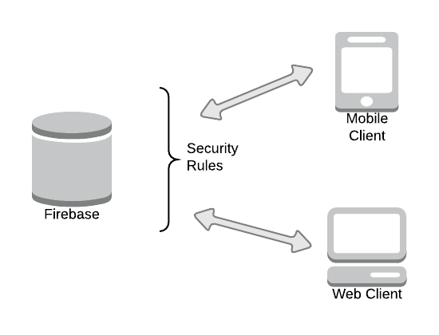

# Chapter 1

## Introduction

The idea for IOU came up from a need raised long before the current technology allowed its' existence.

Being a foreigner living in London for over a decade, means that I had to share my house expenses with my housemates. This is not constrained to myself and my housemates, most of my friends also share their houses or flats. In fact this problem is not even constrained to a foreigner living in a different country, most students and young citizens also find it much easier to share their houses, easing down not only their expenses, but making friends and having due company in the process.

IOU is a simple application, that allows users to share and track their expenses with their Facebook friends, in fact, IOU has been designed so that one is not constrained to only use it for such purposes, one may wish to use it in order to track his own expenses, or who owes who in the last Barbecue party or even a family using it to know what groceries to buy.

The concept aims to be as simple as it can get, users create or are added to lists of products, each user can only view and edit lists that he/she belongs to. Each list has two sublists, a list of users and a list of products. The list of products is then subdivided into two lists, products that are due to be bought and products that have been already bought.

The sum of all products bought in a list, divided by the number of users, is the ideal amount each list member should had spent, however, in practice a member will rarely be in this situation, IOU will then label members as either a debtor or a creditor, if one is a debtor, he/she should be aware that is his/her turn to buy the next round of products.

A list lifecycle can last as long as it's members find suitable, when it is time to close the list, they may review how much each members owe each other, exchange money (which happens without any interference of IOU), then close the list.

For example, a list of expenses between two long term friends may never be closed and a list between housemates may be closed once one or more of the housemates decides to live somewhere else.

By no means IOU guarantees that the members who overspent money in a list will get paid back, it assumes that users have a "Gentlemen's" agreement among each other and should simply be used to track who's turn to buy products is and somewhat act as a reminder as to what should be bought.

At any given time, a user can open any given list and view who owes him/her and who he/she owes money to. This number should be optimised in terms of change, to avoid hassle in terms of money exchange, that is, if one is a creditor in a list, he/she should never need to pay anyone back, likewise, if one is a debtor, he/she should only pay back creditors their given percentage. This in turn should avoid users paying someone who will then use the money to pay someone else.

To make this all work, IOU is distributed as a mobile phone application and enforces users to login using their Facebook profiles. What makes IOU possible now is the fact that most of the population nowadays happen to own a Facebook account as well as a smartphone with access to the internet. This makes the application very convenient, enabling users to easily find their Friends and check what needs to be bought on the go.

## Notes about this documentation

Code blocks appear as the following Scheme hello world example:

    (define hello-world
        (lambda ()
              (begin
             (write ‘Hello-World)
                 (newline)
             (hello-world))))

Code meant to be run in the terminal will be prefixed with a dollar '$' sign, please note that the '$' should not be typed in, as the following Grunt initialise function demonstrates:

    $ grunt init

Figures and captions are displayed like so:

_Fig 1 - Websockets architecture_

